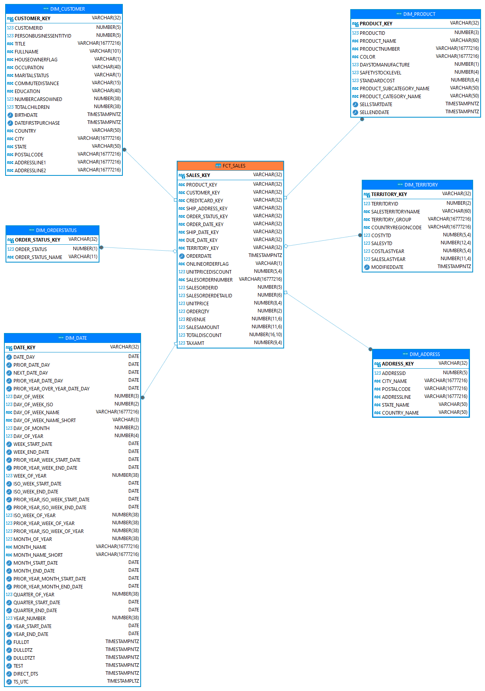

## Hello Everybody

## Commandes utiles

Pour exécuter des modèles :

> $ dbt clean & dbt deps

> $ dbt run -s 1_staging # par les répertoires

> $ dbt run -s 2_intermediate

> $ dbt run -s 3_marts

Pour exécuter des tests :

> $ dbt test --select "source:*"  # all sources
>
> $ dbt test --select source:raw_data  # all sources
>
> $ dbt test --select source:raw_data.address # one source table only

## Modèle Adventure Works Sales < Source >

[AdventureWorks_2019-modules-Sales](https://dataedo.com/samples/html/AdventureWorks/doc/AdventureWorks_2/modules/Sales_12/module.html)

[https://dataedo.com/samples/html/AdventureWorks/doc/AdventureWorks_2/modules/Sales_12/module.html]([https://dataedo.com/samples/html/AdventureWorks/doc/AdventureWorks_2/modules/Sales_12/module.html]())

## Modèle Datamart Sales < Cible >

