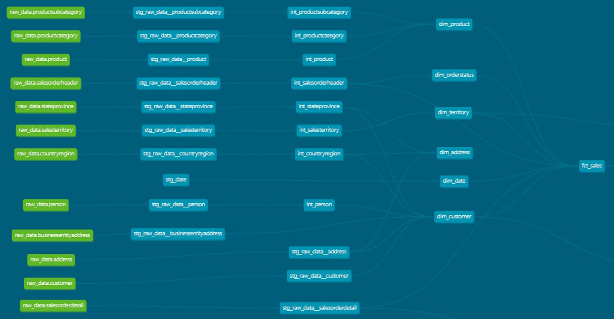

## Hello Everyone

## Commandes utiles

Pour exécuter des modèles :

> $ dbt clean & dbt deps

> $ dbt run -s 1_staging # by sub folders

> $ dbt run -s 2_intermediate

> $ dbt run -s 3_marts

Pour exécuter des tests :

> $ dbt test --select "source:*"  # all sources

> $ dbt test --select source:raw_data  # all sources

> $ dbt test --select source:raw_data.address # one source table only

> $ dbt test -s 1_staging # by sub folders

> $ dbt test -s 2_intermediate

> $ dbt test -s 3_marts

## Modèle Adventure Works Sales < Source >

[AdventureWorks_2019-modules-Sales](https://dataedo.com/samples/html/AdventureWorks/doc/AdventureWorks_2/modules/Sales_12/module.html)

[https://dataedo.com/samples/html/AdventureWorks/doc/AdventureWorks_2/modules/Sales_12/module.html]([https://dataedo.com/samples/html/AdventureWorks/doc/AdventureWorks_2/modules/Sales_12/module.html]())

## Modèle Datamart Sales < Cible >

## dbt Data Pipeline < Transformation >

### Main components list

Views on Source tables : ( folder 1_staging )

* stg_raw_data__address
* stg_raw_data__businessentityaddress
* stg_raw_data__countryregion
* stg_raw_data__customer
* stg_raw_data__person
* stg_raw_data__product
* stg_raw_data__productcategory
* stg_raw_data__productsubcategory
* stg_raw_data__salesorderheader
* stg_raw_data__salesorderdetail
* stg_raw_data__salesterritory
* stg_raw_data__stateprovince

Transient Tables for intermediate transformations : ( folder 2_intermediate )

* int_product
* int_productcategory
* int_productsubcategory
* int_countryregion
* int_stateprovince
* int_person
* int_salesorderheader
* int_salesterritory

Permanent Tables for the final datamart : ( folder 3_marts )

* dim_address
* dim_customer
* dim_date
* dim_orderstatus
* dim_product
* dim_territory
* fct_sales

### Data Preparation (intermediate transformations)

* Product
    *to cast or convert and to rename the following data : ProductName, ProductCategory, ProductSubCategory*
* Person
    *blabla...*
* Sales Territory, State Province
    *blabla...*
* Sales Order Header
    *blabla...*
