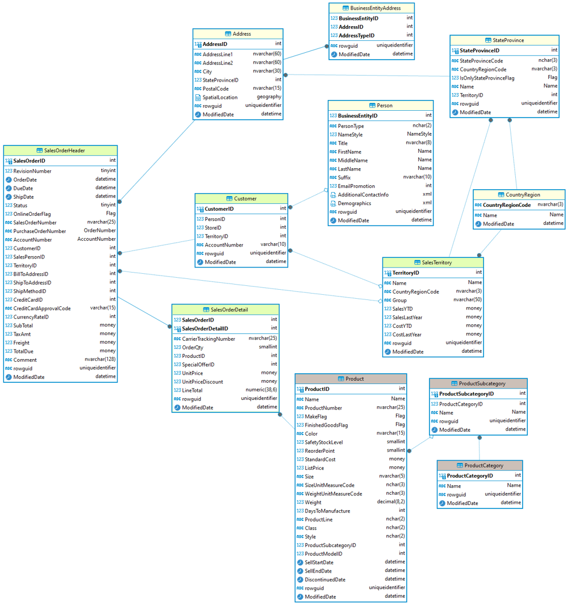
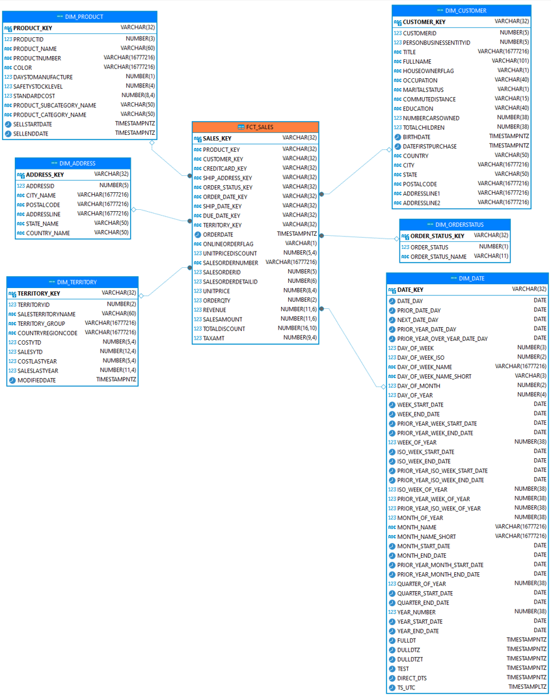
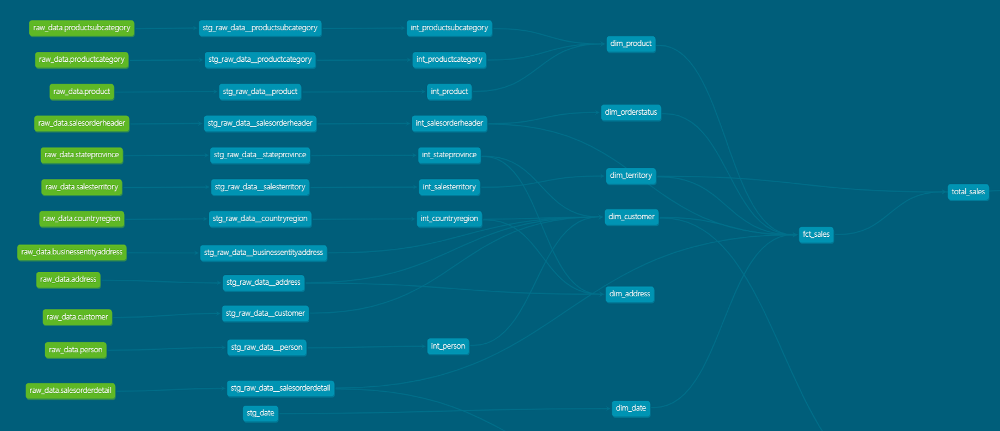

## Short description

*ToDo*

## **Useful commands**

To run models:

> dbt clean & dbt deps

> $ dbt run -s 1_staging # by sub folders

> $ dbt run -s 2_intermediate

> $ dbt run -s 3_marts

To run tests:

> $ dbt test --select "source:*"  # all sources

> $ dbt test --select source:raw_data  # all sources

> $ dbt test --select source:raw_data.address # one source table only

> $ dbt test -s 1_staging # by sub folders

> $ dbt test -s 2_intermediate

> $ dbt test -s 3_marts

## Modèle AdventureWorks Sales < Source >

[AdventureWorks_2019-modules-Sales](https://dataedo.com/samples/html/AdventureWorks/doc/AdventureWorks_2/modules/Sales_12/module.html)

## Modèle Datamart Sales < Cible >

## Environments

* RAW_DATA
* MODEL_DATA (MODEL_WRK)

  *ToDo*

## dbt Data Pipeline < Transformation >

### Main components list

Views on Source tables : ( folder 1_staging )

* stg_raw_data__address
* stg_raw_data__businessentityaddress
* stg_raw_data__countryregion
* stg_raw_data__customer
* stg_raw_data__person
* stg_raw_data__product
* stg_raw_data__productcategory
* stg_raw_data__productsubcategory
* stg_raw_data__salesorderheader
* stg_raw_data__salesorderdetail
* stg_raw_data__salesterritory
* stg_raw_data__stateprovince

Transient Tables for intermediate transformations : ( folder 2_intermediate )

* int_product
* int_productcategory
* int_productsubcategory
* int_countryregion
* int_stateprovince
* int_person
* int_salesorderheader
* int_salesterritory

Permanent Tables for the final datamart : ( folder 3_marts )

* dim_address
* dim_customer
* dim_date
* dim_orderstatus
* dim_product
* dim_territory
* fct_sales

### Data Preparation (intermediate transformations)

* Product
  *to cast or convert and to rename the following data : ProductName, ProductCategory, ProductSubCategory*
* Person
  *to cast or convert and to rename the following data : FirstName, MiddleName, LastName
  to parse and extract data from an XML column : Demographics*
* Sales Territory, State Province
  to cast or convert and to rename the following data : SalesTerritoryName, StatProvinceName
* Sales Order Header
  *to decode boulean data into Y/N code*
  *to cast or convert and to rename the following data : PurchaseOrderNumber, AccountNumber*

### Sales Datamart Design

* Analysis axes

| Name         | Dimension       | source(s)                                                                                                                                                | Transformation(s)                                                                                                                                                                                 |
| ------------ | --------------- | -------------------------------------------------------------------------------------------------------------------------------------------------------- | ------------------------------------------------------------------------------------------------------------------------------------------------------------------------------------------------- |
| customer     | dim_customer    | stg_raw_data__customer int_person stg_raw_data__address stg_raw_data__businessentityaddress int_stateprovince int_countryregion | adding the surrogate key "customer key" concatenation of full name (first_name + last_name)                                                                                                  |
| product      | dim_product     | int_product int_productcategory int_productsubcategory                                                                                         | adding the surrogate key "product_key" renaming the following columns :  product_subcategory_name and product_category_name                                                           |
| order status | dim_orderstatus | int_salesorderheader                                                                                                                                     | adding the surrogate key "order_status_key" decoding of order status codes by labels                                                                                                         |
| address      | dim_address     | stg_raw_data__address int_stateprovince int_countryregion                                                                                      | adding the surrogate key "address_key" concatenation of full address line (addressline1 + addressline2) renaming the following columns :  city_name, state_name, country_name |
| territory    | dim_territory   | int_salesterritory                                                                                                                                       | adding the surrogate key "territory_key" renaming the "territory_group" column                                                                                                               |

* Analysis topic
  * name : Sales
  * fact : fact_sales
  * sources : stg_raw_data__salesorderdetail, int_salesorderheader
  * transformations :
    * add the following serogate keys : sales_key, product_key, customer_key, creditcard_key, ship_address_key, order_status_key, order_date_key,  ship_date_key, due_date_key, territory_key
    * calculate the total discount amount

## Automated Tests

*ToDo3*
